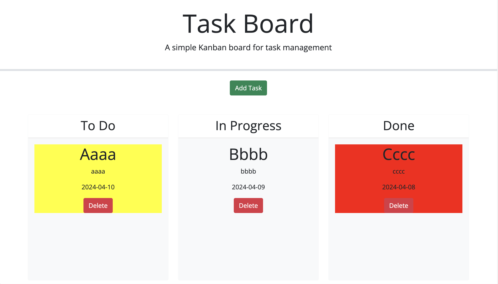

# project-task-board

## Description

- The motivation behind this project was to create a task board that stores task data in the local storage, then displays that information in a task board. The tasks were to be draggable, adhere to their new lanes, change colors based on due date vs the current date and have functional delete buttons that remove the task card from the page and local storage.

- This by far has been the most challenging task thus far in the course. We were to utilize everything we have learned so far, but also encounter many requests to accomplish things we have not learned yet. Being forced to think outside the box and not be afraid to try things that might break the code really pushed me to grow as a developer. Although a source of many headaches, I enjoyed overcoming the challenges and am ultimately proud of the work.

Live site: 